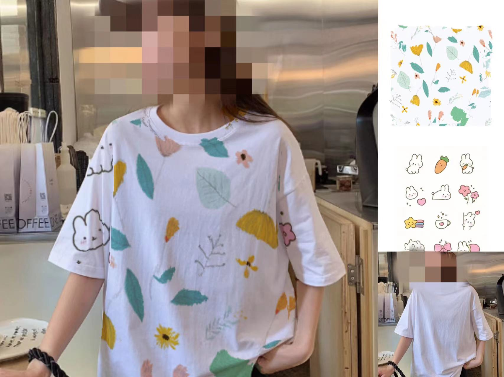

# Lps

This is a technology that replaces the texture of 2D clothing images, implemented using WebGL. The unique feature is that the replaced texture will deform according to the real clothing's crease information, resulting in a natural and realistic effect.

I recently experienced a layoff and have been unemployed for a while. I need some income to sustain my livelihood, so I have resorted to accepting payments on GitHub. If you would like to purchase my products, please transfer the money to my PayPal account. Here is the payment link: https://www.paypal.com/paypalme/xfhxbb

Thank you for your support. I kindly request that you notify me of the shipment via email. Please send me an email to my email address: xfhxbb@yeah.net.
